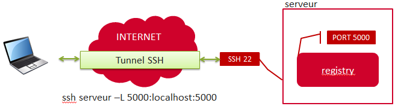

= Docker

== Registry privé

J'utilise un registry privé afin de déposer mes images docker.
Depuis l'extérieur, ce registry est accessible via un tunnel SSH.

**Installer le registry**

Le registry est fourni sous forme d'une image docker.

  docker pull registry:0.8.1

**Lancer le registry**

    docker run --name="registry" -d 5000:5000 -v /mnt/stockage1/docker/registry:/data -e STORAGE_PATH=/data registry:0.8.1

    
**Connexion au registry**

    ssh serveur –L 5000:localhost:5000

    
**Déposer une image dans ce registry**

L'username de l'image doit être remplacé par l'url du registry. Pour faire la différence entre un nom d'utilisateur et une url, docker analyse la présence de "." ou de ":"
Le nom du tag de l'image doit être de la sorte URL_REGISTRY/NOM_IMAGE

Le tag peut s'effectuer soit au moment du build, soit après via la commande _docker tag_:
   
   docker build -t localhost:5000/acimflo-ddclient .
   docker tag 8dbd9e392a96 localhost:5000/acimflo-ddclient