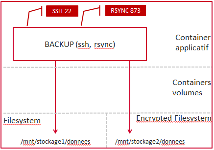

= Backup

Le but de cette image est de créer un container docker exposant 

  * un service rsync pour sauvegarder les fichiers des postes windows situés sur le même réseau
  * un service ssh pour sauvegarder les fichiers d'un poste à travers Internet via rsync

 

== Architecture

Deux ports sont exposés :
  
  * **22** : port du serveur ssh
  * **873** : port du serveur rsync

La configuration de rsync est à fournir lors du run via un volume. La connexion ssh ne s'effectue qu'avec une clé. Le conteneur ne contenant aucune clé autorisée, il est impératif d'utiliser le répertoire _.ssh_ de la machine hôte grâce à un volume.

  
Les chemins de stockage des modules rsync exposés sont situés dans le répertoire /data/ et /data_crypt du container. Le dernier contient des données chiffrées contrairement au premier. Pour ce faire, il fait monter avec l'option _"-v"_ les volumes correspondants.

Le container contient un utilisateur nommé _system_ et ayant le uid et le gid 1000. Cet utilisateur sert à écrire les fichiers dans le répertoire /data/ (pour ne pas les écrire en root).
Pour fonctionner correctement, cela suppose que le système hôte dispose d'un utilisateur ayant un uid et gid valant 1000.
L'utilisateur _system_ sert également pour la connexion ssh.

== Builder l'image
  
    docker build -t localhost:5000/acimflo-backup .
	
== Lancer l'image

    docker run --name="backup" -d -v /mnt/stockage1/donnees/:/data -v /mnt/stockage2/donnees/:/data_crypt -v /mnt/stockage1/docker/backup/rsyncd.conf:/etc/rsyncd.conf -v /mnt/stockage1/docker/backup/rsyncd.secrets:/etc/rsyncd.secrets -v /home/jerep6/.ssh:/home/system/.ssh -p 873:873 -p 10022:22 localhost:5000/acimflo-backup