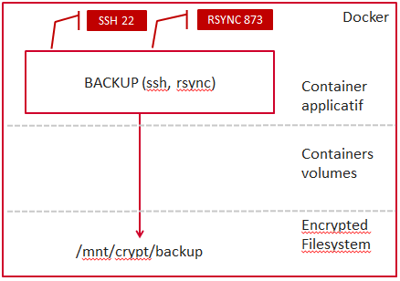

= Backup

Le but de cette image est de créer un container docker exposant 

  * un service rsync pour sauvegarder les fichiers des postes windows situés sur le même réseau
  * un service ssh pour sauvegarder les fichiers d'un poste à travers Internet via rsync

 

== Architecture

Deux ports sont exposés :
  
  * **22** : port du serveur ssh
  * **873** : port du serveur rsync

Les chemins de stockage des modules rsync exposés sont situés dans le répertoire /data/ du container.
Ce répertoire est à mapper sur la machine hôte via l'option _-v_ de docker run. Le dossier est mappé directement sur les répertoires de la machine afin de crypter les données.
Le dossier cible est une partition LUKS.

Le container contient un utilisateur nommé _system_ et ayant le uid et le gid 1000. Cet utilisateur sert à écrire les fichiers dans le répertoire /data/ (pour ne pas les écrire en root).
Pour fonctionner correctement, cela suppose que le système hôte dispose d'un utilisateur ayant un uid et gid valant 1000.
L'utilisateur _system_ sert également pour la connexion ssh.

  

== Builder l'image
  
    docker build -t jerep6/acimflo-backup:1.0 Backup/
	
== Lancer l'image
    docker run -d -ti --name=backup -v /home/jerep6/docker/data/:/data -v /path_to_home/.ssh/authorized_keys:/home/system/.ssh/authorized_keys -p 873:873 -p 22:22 jerep6/acimflo-backup:1.0 /bin/bash