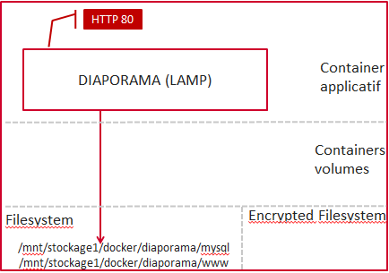

= Diaporama

Le but de cette image est de créer un serveur lamp. Elle contient les logiciels suivants :

  * mysql
  * apache2
  * php5
  * phpmyadmin
 

== Architecture

Seul le port **80** du serveur web apache est exposé.
  

Le répertoire des données de mysql est /app/mysql. Il doit être monté grâce à un volume. Il faudra penser à initialiser ce répertoire avec le script **/tmp/mysql_change_database_directory.sh**. Cela créera les dossiers et fichiers de mysql dans le répertoire cible ainsi que l'utilisateur debian dédié à la maintenance.

Le répertoire du serveur apache est /app/www/. Le code php du diaporama doit donc être déposé ici. Encore une fois les volumes sont la solution.

== Builder l'image
  
    docker build -t localhost:5000/acimflo-diaporama .

== Initialiser l'image
Comme décrit précédemment, il est nécessaire d'initialiser le répertoire de mysql car celui-ci est monté via un volume : 

   docker run -ti -v /mnt/stockage1/docker/diaporama/mysql:/app/mysql/ localhost:5000/acimflo-diaporama /bin/bash
   sh /tmp/mysql_change_database_directory.sh
   
Il faut maintenant créer l'utilisateur mysql pour le diaporama :

    MYSQL_USER="diaporama"
    MYSQL_PWD="diaporama"
    mysql -uroot -e "GRANT ALL ON ${MYSQL_USER}.* TO ${MYSQL_USER}@'%' IDENTIFIED BY '$MYSQL_PWD' WITH MAX_QUERIES_PER_HOUR 0 MAX_CONNECTIONS_PER_HOUR 0 MAX_UPDATES_PER_HOUR 0 MAX_USER_CONNECTIONS 0; CREATE DATABASE IF NOT EXISTS ${MYSQL_USER};"
    

== Lancer l'image

    docker run --name="diaporama" -d -v /mnt/stockage1/docker/diaporama/www:/app/www/ -v /mnt/stockage1/docker/diaporama/mysql:/app/mysql/ -p 80:80 localhost:5000/acimflo-diaporama